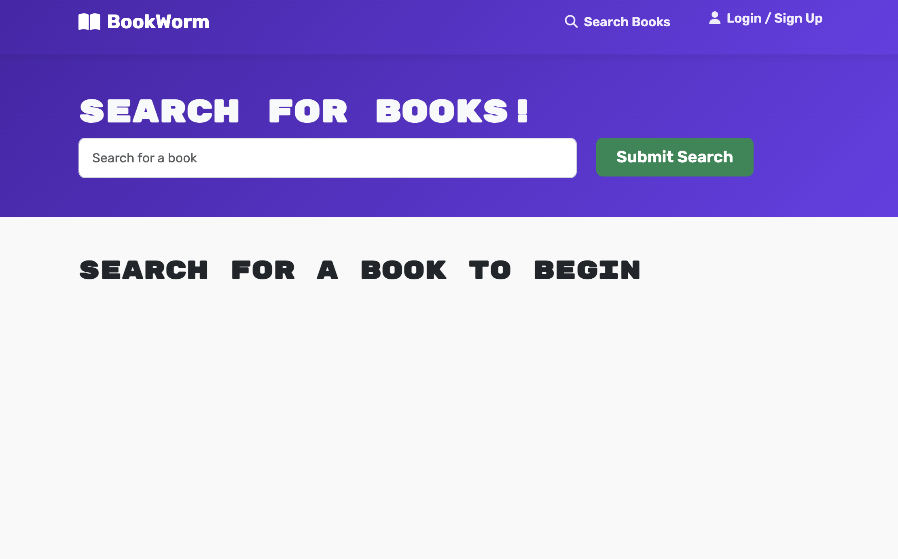
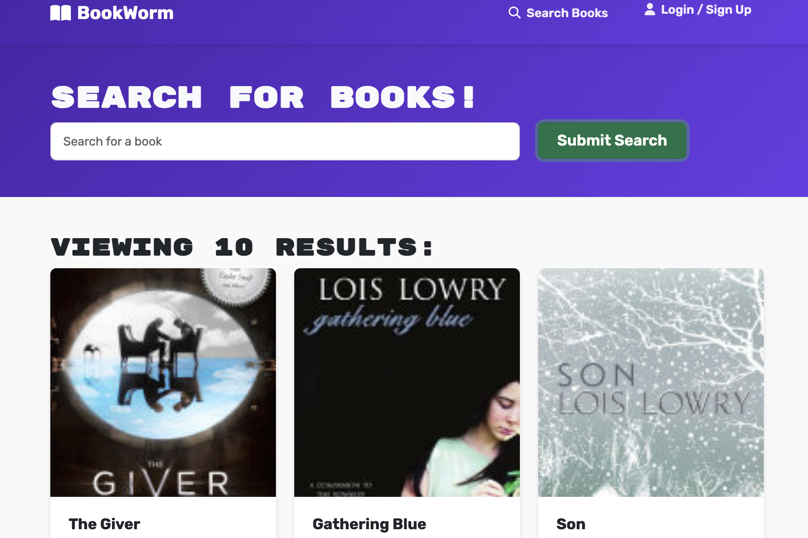
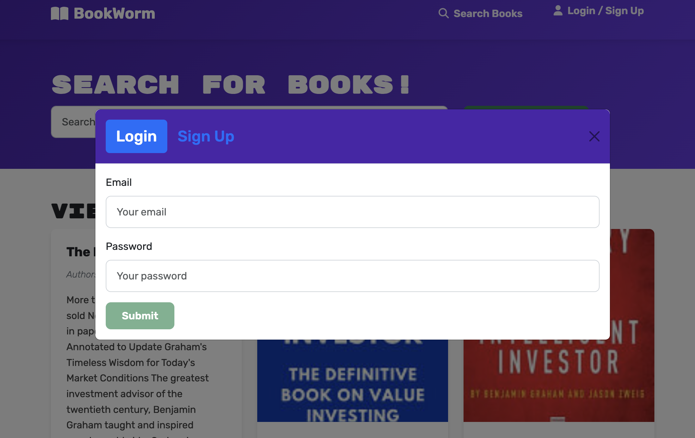
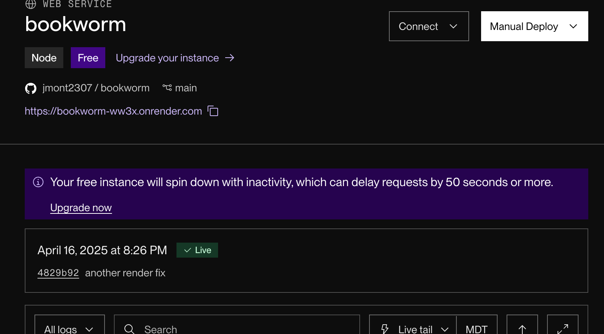

# book-search-engine

**book-search-engine** is a full-stack web application that allows users to search for books, save them to their personal library, and manage their reading list. The application uses the Google Books API to provide book data and features a modern, responsive UI.

## Features

- Search for books using the Google Books API
- Create a user account to save and manage books
- View book details including title, author, description, and cover image
- Save books to your personal library
- Remove books from your library
- Responsive design that works on desktop and mobile devices

## Technology Stack

- **Frontend**: React, Bootstrap, Apollo Client
- **Backend**: Node.js, Express
- **Database**: MongoDB with Mongoose ODM
- **API**: GraphQL with Apollo Server
- **Authentication**: JWT (JSON Web Tokens)
- **Deployment**: Render with MongoDB Atlas

## Getting Started

### Prerequisites

- Node.js (v14 or higher)
- MongoDB
- npm or yarn

### Installation

1. Clone the repository:
   ```
   git clone https://github.com/adeleinealger/book-search-engine.git
   cd book-search-engine
   ```

2. Install dependencies for both server and client:
   ```
   npm install
   ```

3. Start the development server:
   ```
   npm run dev
   ```

This will launch both the client (on port 3000) and server (on port 3001) concurrently.

## 📸 Screenshots/Link

### Screenshots
- **Search Page**: 
- **Search Results**: 
- **Login Modal**: 
- **Deployed Application**: 

### Deployed Application

TODO
Access the live application here: [book-search-engine on Render](https://book-search-engine-ww3x.onrender.com)

## API Endpoints

The application uses GraphQL API with the following operations:

### Queries
- `me`: Returns the logged-in user's data including saved books

### Mutations
- `addUser`: Creates a new user account
- `login`: Authenticates a user
- `saveBook`: Saves a book to the user's account
- `removeBook`: Removes a book from the user's account

## GraphQL Schema

```graphql
type Book {
  bookId: String!
  authors: [String]
  description: String!
  title: String!
  image: String
  link: String
}

type User {
  _id: ID!
  username: String!
  email: String!
  bookCount: Int
  savedBooks: [Book]
}

type Auth {
  token: ID!
  user: User
}

type Query {
  me: User
}

type Mutation {
  login(email: String!, password: String!): Auth
  addUser(username: String!, email: String!, password: String!): Auth
  saveBook(input: BookInput!): User
  removeBook(bookId: String!): User
}
```

## License

This project is licensed under the MIT License - see the LICENSE file for details.
